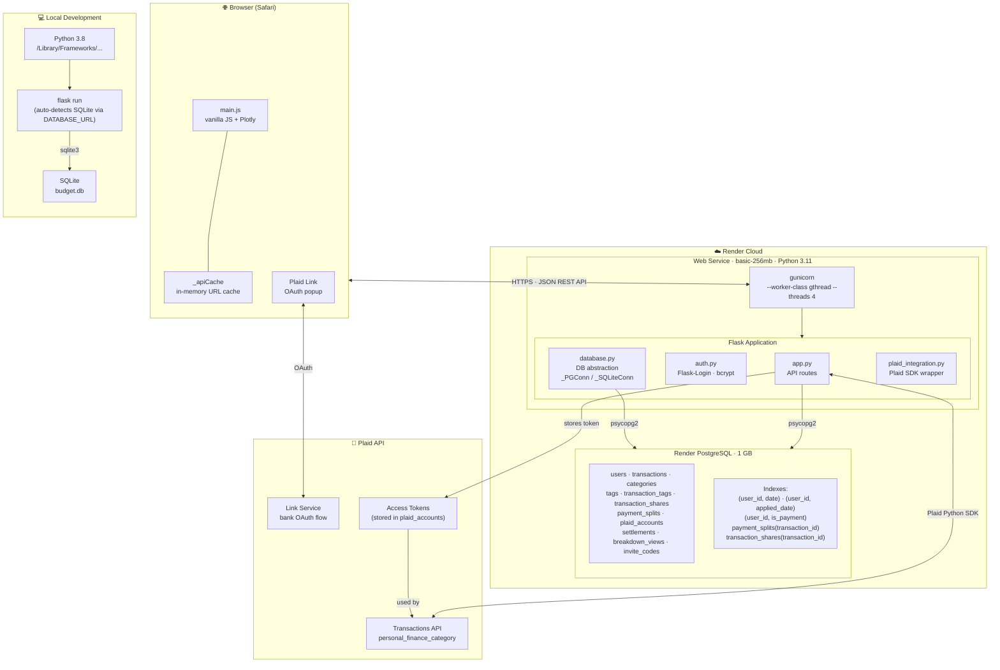

# Infrastructure Diagram

> Open this file in VS Code Markdown Preview (`Cmd+Shift+V`) to render the diagram.

## Key Design Decisions

| Concern | Approach |
|---|---|
| DB portability | `_SQLiteConn` / `_PGConn` wrappers — same SQL, `%s` params everywhere |
| Concurrency | `gthread` worker — 4 threads share 1 process (memory-efficient on 256 MB) |
| Auth | Flask-Login + bcrypt; invite-gated self-registration (`/register` + `create_invite.py` CLI + in-app generator for user_id=1) |
| Performance | Client-side `_apiCache` (URL-keyed); two-phase `loadSummary`; prefetch Sankey + Shared Ledger |
| Plaid | `plaid_integration.py` isolated; `PLAID_ENV` env var switches sandbox ↔ production |

## Scaling Levers (when needed)

1. **Upgrade Render CPU tier** — biggest per-request latency win
2. **DB connection pooling** (pgBouncer or psycopg2 pool) — prevents connection exhaustion under concurrent load
3. **More RAM → more workers** — 512 MB+ enables `--workers 2 --threads 4`
